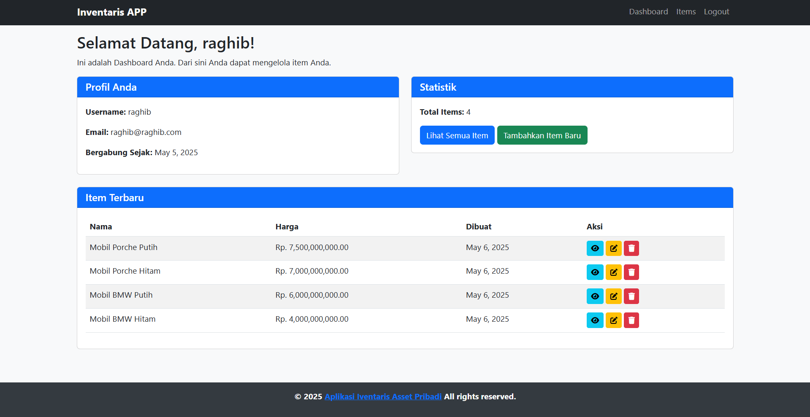
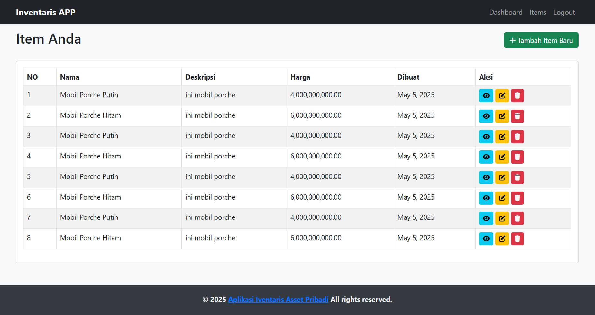
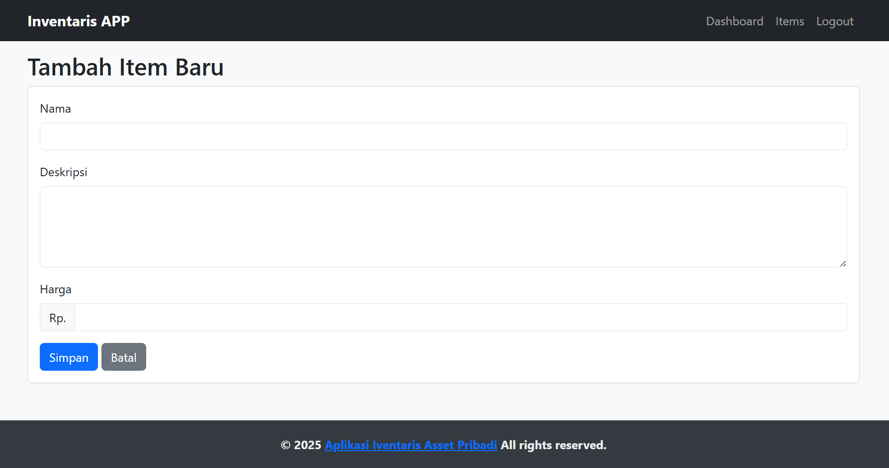
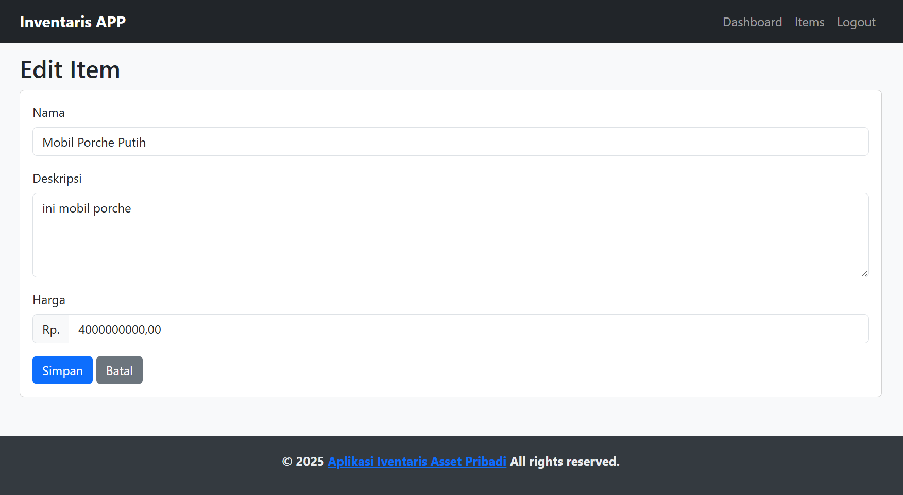
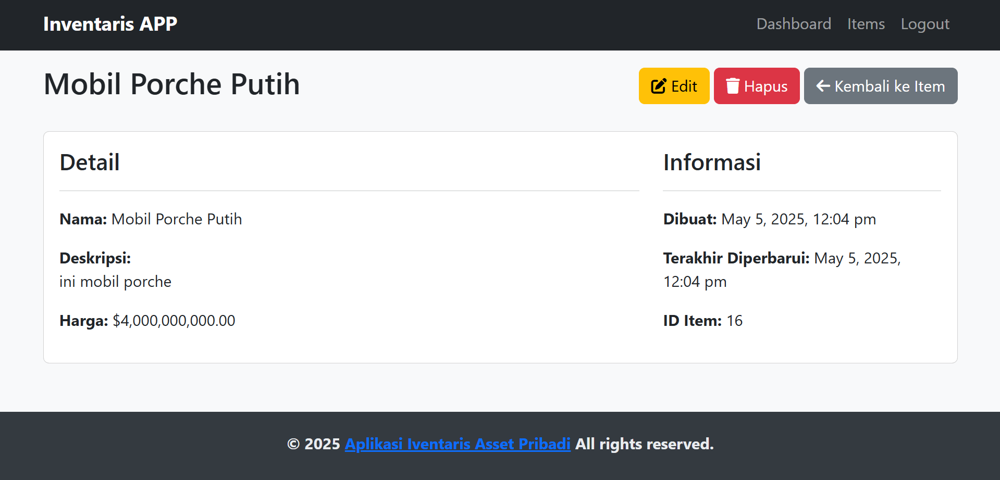
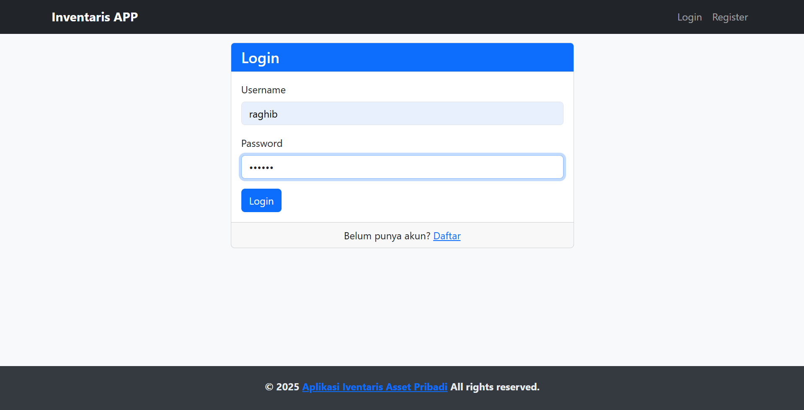
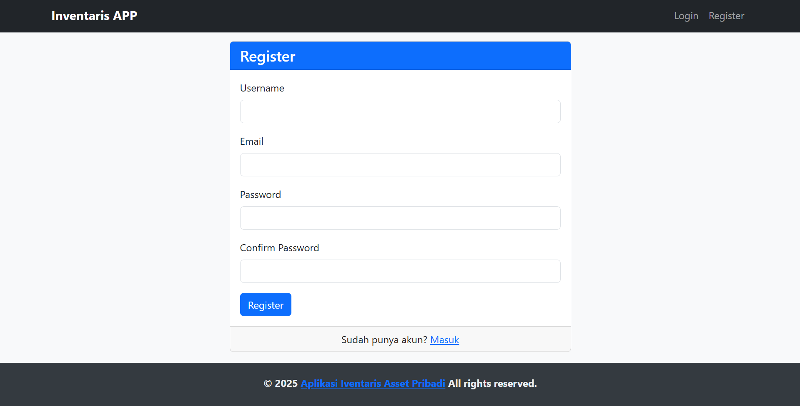

# CodeIgniter 3 CRUD Inventaris APP

Aplikasi web lengkap yang dibangun dengan framework CodeIgniter 3 yang menampilkan operasi CRUD, autentikasi pengguna, dan desain responsif.

## Features

### 1. CRUD Operations
* **Create**: Tambahkan item baru ke database
* **Read**: Melihat dan menelusuri item
* **Update**: Edit item yang ada
* **Delete**: Hapus item dari database

### 2. User Authentication
* Sistem registrasi yang aman
* Fungsionalitas login/logout
* Hashing kata sandi untuk keamanan
* Manajemen sesi

### 3. Object-Oriented Programming (OOP)
* Penggunaan kelas (Class) dan pewarisan (Inheritance) yang tepat
* Arsitektur Model-View-Controller (MVC)
* Pemisahan masalah yang jelas

### 4. Routing
* URL yang bersih dan ramah SEO
* Definisi route khusus
* Penulisan ulang URL dengan .htaccess

### 5. Templating
* Tata letak yang konsisten di seluruh halaman
* Komponen header dan footer yang dapat digunakan kembali
* Desain responsif berbasis bootstrap

## Requirements

* PHP 5.6 atau yang terbaru
* MySQL Database
* Server web Apache dengan mod_rewrite yang diaktifkan
* CodeIgniter 3.x
* Bootstrap 5.x

## Installation and Setup

1. **Clone the repository or download the project files**
   ```
   git clone https://github.com/xenossz/inventaris_app.git
   ```

2. **Configure your web server**
   * Letakkan file proyek di direktori root atau subdirektori server web Anda
   * Pastikan mod_rewrite diaktifkan di Apache

3. **Create a database**
   * Buat database MySQL baru dengan nama `inventaris_asset`
   * Aplikasi akan secara otomatis membuat tabel yang diperlukan saat pertama kali dijalankan

4. **Configure the application**
   * Buka `application/config/database.php` dan perbarui pengaturan koneksi database:
   ```php
   $db['default'] = array(
   'hostname' => 'localhost',
   'username' => 'your_username', // Ubah ini
   'password' => 'your_password', // Ubah ini
   'database' => 'inventaris_asset',
   'dbdriver' => 'mysqli',
   // Pengaturan lainnya...
   );
   ```
   * Buka `application/config/config.php` dan perbarui URL dasar:
   ```php
   $config['base_url'] = 'http://localhost/your-project-folder/'; // Ubah ini
   ```

5. **Set proper file permissions**
   * Pastikan direktori `application/cache` dan `application/logs` dapat ditulis

6. **Access the application**
   * Buka browser web Anda dan navigasikan ke URL dasar yang Anda konfigurasikan

## Application Structure

```
inventaris_asset/
├── application/
│   ├── config/
│   │   ├── autoload.php
│   │   ├── config.php
│   │   ├── database.php
│   │   └── routes.php
│   ├── controllers/
│   │   ├── Auth.php
│   │   ├── Dashboard.php
│   │   └── Items.php
│   ├── models/
│   │   ├── User_model.php
│   │   └── Item_model.php
│   └── views/
│       ├── templates/
│       │   ├── header.php
│       │   └── footer.php
│       ├── auth/
│       │   ├── login.php
│       │   └── register.php
│       ├── dashboard/
│       │   └── index.php
│       └── items/
│           ├── create.php
│           ├── edit.php
│           ├── index.php
│           └── view.php
├── .htaccess
└── index.php
```

## Usage

1. **User Registration**
   * Buka halaman pendaftaran
   * Isi informasi yang diperlukan
   * Kirim formulir untuk membuat akun baru

2. **Login**
   * Gunakan akun Anda untuk masuk
   * Akses area aplikasi yang dilindungi

3. **Managing Items**
   * Buat item baru dengan mengisi detail item
   * Lihat daftar semua item Anda di halaman item
   * Edit item dengan mengklik tombol edit
   * Hapus item dengan mengklik tombol hapus
   * Lihat informasi terperinci tentang setiap item

## Security Features

* Hashing kata sandi menggunakan fungsi password_hash() PHP
* Validasi formulir untuk mencegah data tidak valid
* Manajemen sesi untuk pengguna yang diautentikasi
* Perlindungan terhadap akses tidak sah ke tindakan dan data

## Customization

* Tambahkan kolom ke tabel pengguna atau item sesuai kebutuhan
* Perluas fungsionalitas dengan membuat controllers dan models baru
* Ubah tampilan untuk mengubah tampilan

## Troubleshooting

**Issue**: Penulisan ulang URL tidak berfungsi
* Pastikan mod_rewrite diaktifkan di Apache
* Periksa apakah file .htaccess dikonfigurasi dengan benar

**Issue**: Kesalahan koneksi database
* Verifikasi kredensial database Anda
* Pastikan server MySQL berjalan

**Issue**: Masalah izin
* Periksa apakah direktori application/cache dan application/logs dapat ditulis

## Contributing

1. Fork repositori
2. Buat branch baru untuk fitur Anda
3. Komit perubahan Anda
4. Dorong ke branch Anda
5. Buat Pull Request baru

## License

Proyek ini dilisensikan di bawah Lisensi MIT - lihat berkas LICENSE untuk detailnya.

## Credits

* [CodeIgniter](https://codeigniter.com/) - The web framework used
* [Bootstrap](https://getbootstrap.com/) - CSS framework
* [Font Awesome](https://fontawesome.com/) - Icons

## Screenshot
* Halaman Dashboard


* Halaman Items


* Halaman Tambah Items


* Halaman Edit Items


* Halaman View Items


* Halaman Login


* Halaman Register


## Author

Raghib Galieh Basmallah - [raghibbasmallah@gmail.com](mailto:raghibbasmallah@gmail.com)

